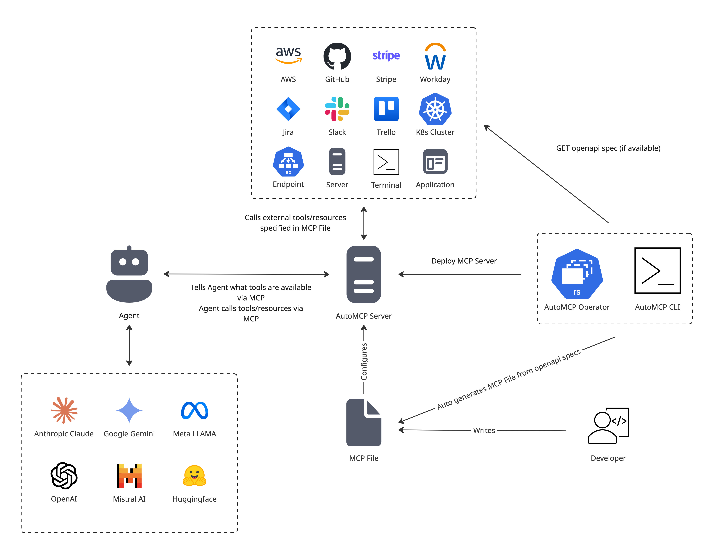

# AutoMCP: Effortless MCP Server Creation

The Model Context Protocol (MCP) provides a standardized way to expose tools, prompts,
and resources to LLMs, powering the development of complex agents and standardizing
how developers provide LLMs access to external systems and APIs.

However, the process of building MCP servers involves lots of manual work to wrap existing
APIs into the protocol, and requires learning the protocol and associated SDK.

AutoMCP automates this process. Instead of requiring you to write an MCP server to wrap your
APIs or other systems, it only requires you to describe what tools it should expose as well
as how to call them. AutoMCP handles everything else for the MCP server for you, freeing up
developers to focus on how their APIs and tools are built and deployed, rather than on MCP
server implementation details.

Whether you are a developer aiming to expose your work through MCP, or a consumer looking to
interact with existing APIs through an MCP server that hasn't been built yet, AutoMCP is your
solution.

 

## Features

1. **Automatic MCP Server Creation**: Create fully functional MCP servers diretly from a
simple MCP file
2. **OpenAPI to MCP File Conversion**: Effortlessly create MCP files directly
from your existing OpenAPI docs.

## Documentation

To learn how to write your own MCP Files, please read [the MCP file format docs](./docs/mcp_file_format.md)

## Getting Started

To get started with AutoMCP, you first need to build the CLI and server binaries. Then, you can use the CLI to manage your MCP servers.

### Building the Binaries

Both the `automcp` CLI and the `automcp-server` can be built from the `cmd` directory:

```bash
go build -o automcp ./cmd/automcp
go build -o automcp-server ./cmd/automcp-server
```

Once built, it is recommended to add the binaries to your path. For example, by moving them to `/usr/local/bin`:

```bash
mv automcp automcp-server /usr/local/bin
```

### CLI Usage

The `automcp` CLI provides several commands to help you manage your MCP servers.

#### `run`

The `run` command starts an MCP server. It requires an `mcpfile.yaml` to be present in the current directory, or you can specify a path to the file using the `-f` or `--file` flag.

```bash
automcp run -f /path/to/your/mcpfile.yaml
```

By default, the server runs in the foreground. To run it in the background, use the `-d` or `--detach` flag.

```bash
automcp run -d
```

#### `stop`

The `stop` command stops a detached MCP server. It uses the `mcpfile.yaml` to find the process ID of the server to stop.

```bash
automcp stop -f /path/to/your/mcpfile.yaml
```

If the `mcpfile.yaml` is in the current directory, you can just run:

```bash
automcp stop
```

#### `convert`

The `convert` command converts an OpenAPI specification to an `mcpfile.yaml`. It takes the path to the OpenAPI spec as an argument. The spec can be a local file or a remote URL.

```bash
automcp convert /path/to/your/openapi.json
```

By default, the output is written to `mcpfile.yaml`. You can specify a different output path with the `-o` or `--out` flag.

```bash
automcp convert https://petstore.swagger.io/v2/swagger.json -o my-petstore.yaml
```

